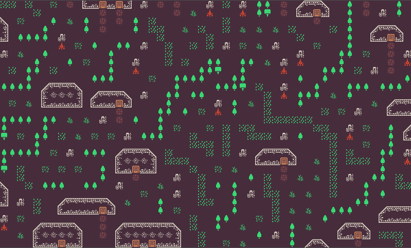
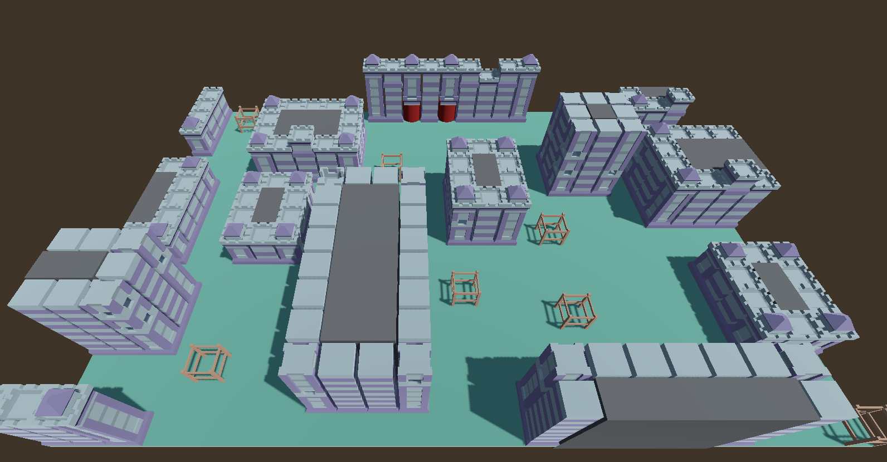

# Godot-WFC-Csharp

This is a wave function collapse implementation for Godot in C#.

Please refer to Examples on how to use. basically you need 2 tile maps. one to create a new map on (target) and one to use as a sample on how the tiles are used (sample).

Features:
- Create map based on a sample
- Differnt match levels are possible (through changing MATCH_RADIUS)
- Multi-threading
- Possibility based tile placement
- Fail correction
- Has a base generator class that can be expanded for your use
- 2D and 3D generation
- Currently has built in support for TileMap2D and GridMap( 2D or 3D )
  
To Do:
- Chunk-based multithreading

made with Godot v4.2.1
